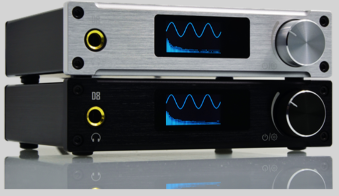
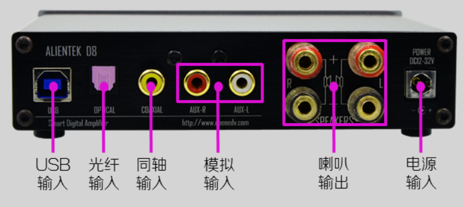

D8-HiFi数字功放
============================================

D8-HiFi数字功放具备XMOS/USB/DAC解码器,具有光纤/同轴 可配蓝牙、家用音频放大。

资料链接
------------

模块使用资料
^^^^^^^^^^

- 百度网盘-链接：https://pan.baidu.com/s/1Hj0FHzX-UkJLtSTcaMEmgg
- 提取码：ii9e
  
产品讨论帖
^^^^^^^^^^  

- D8-HiFi数字功放产品讨论贴: http://www.openedv.com/posts/list/0/63879.htm

产品图片
--------

D8-HiFi数字功放主图如下所示

.. _pic_major_D8:

   
  D8-HiFi数字功放实物图正面（白色款）

.. _pic_major_D8:

   
  D8-HiFi数字功放实物图正面（黑色款）

购买方式
-------- 

正点原子官方淘宝店：https://openedv.taobao.com 

产品问题答疑
------------

- 阿里旺旺：https://openedv.taobao.com 上淘宝直接一对一咨询技术。  
- 开源电子网【论坛】：http://www.openedv.com/forum.php 
- QQ群：http://www.openedv.com/forum.php   点击首页“官方QQ群”即可加入最新群。 
- 微信群：http://www.openedv.com/forum.php 点击首页“微信群”即可加入最新群。
  

关于正点原子  
-----------------

 | :ref:`公司简介` 
 | :ref:`联系方式`

   
   
   

