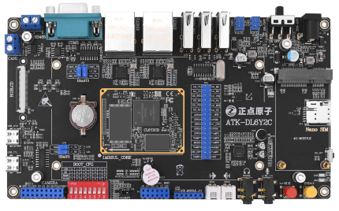
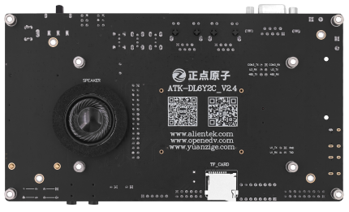

i.MX6ULL Linux阿尔法开发板
=======================

开发板介绍
----------

- ``开发板资料介绍视频`` B站哔哩哔哩链接：https://www.bilibili.com/video/av68994676  

- ``开发板QT5演示视频`` B站哔哩哔哩链接：https://www.bilibili.com/video/av61255737  

资料下载链接
------------

资料盘链接
^^^^^^^^^^^

- ``资料盘`` 开发板资料链接：https://pan.baidu.com/s/1inZtndgN-L3aVfoch2-sKA  提取码：m65i

- ``资料盘`` PDF合集资料链接：https://pan.baidu.com/s/1FSJY3PdFgV2WV4lT6Ps8fA  提取码：qsxb

- ``资料盘`` 视频PPT笔记链接：https://pan.baidu.com/s/12C3yhpVuugtaHkhWjxfsSg  提取码：ho0m

Gitee(码云)文档与代码资料下载链接
^^^^^^^^^^^

- ``Gitee(码云)`` 下载链接：https://gitee.com/GuangzhouXingyi/projects

I.MX6U 虚拟机链接
^^^^^^^^^^^
- 学习正点原子I.MX6ULL驱动开发指南、嵌入式QT开发指南等文档教程时，可以使用已经搭建好的虚拟机环境像，节省环境搭建时间。

- ``工具盘`` 百度网盘链接：https://pan.baidu.com/s/1X_sutSwtYNooaaZ9vSz9Rw  提取码：phw9

视频网盘链接
^^^^^^^^^^^

-  配套 ``Linux之Ubuntu入门篇`` 视频链接：https://pan.baidu.com/s/1GNdsA6lhPy15vahOYMMngw  提取码：80vf

-  配套 ``Linux之ARM裸机篇`` 视频链接：https://pan.baidu.com/s/1TjaQSuRZK0OiUCqc6S0SiQ  提取码：r27n  

-  配套 ``Linux之系统移植和文件系统构建篇`` 视频链接：https://pan.baidu.com/s/1ZlhaCTsdBlYdSAWVtQH_sw  提取码：x2z8

-  配套 ``Linux之驱动开发篇`` 视频链接：https://pan.baidu.com/s/1JU95JHG-v7MKvkvXsMNhdw 提取码：n3ju
      
视频在线学习平台
^^^^^^^^^^^^^^^^^

- 视频网盘如果失效，请移步在线观看平台：

1. 原子哥在线教学平台免费观看: https://www.yuanzige.com
#. B站哔哩哔哩：https://space.bilibili.com/394620890
#. 腾讯课堂：https://ke.qq.com/course/278479
   
   
产品讨论帖
^^^^^^^^^^^^^^^^^

- i.MX6ULL Linux阿尔法产品讨论贴: http://www.openedv.com/thread-300792-1-1.html

- 正点原子阿尔法Linux开发板交流群：1027879335

产品图片
--------

- i.MX6ULL Linux阿尔法开发板主图如下所示

.. _pic_major_imx6ull_board:

   
 i.MX6ULL Linux阿尔法开发板正面图

.. _pic_major_imx_6ull_core:

   
 i.MX6ULL Linux阿尔法开发板背面图

购买方式
-------- 

- 正点原子官方淘宝店：https://openedv.taobao.com 

产品问题答疑
------------

- 阿里旺旺：https://openedv.taobao.com 上淘宝直接一对一咨询技术。  
- 开源电子网【论坛】：http://www.openedv.com 
- QQ群：http://www.openedv.com   点击首页“官方QQ群”即可加入最新群。 
- 微信群：http://www.openedv.com 点击首页“微信群”即可加入最新群。
  

关于正点原子  
-----------------

 | :ref:`公司简介` 
 | :ref:`联系方式`

