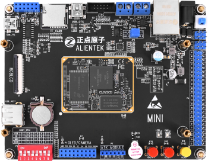

Mini Linux开发板
=======================

开发板介绍
----------

- ``开发板资料介绍视频`` B站哔哩哔哩链接：https://www.bilibili.com/video/av68994676  

- ``开发板QT5演示视频`` B站哔哩哔哩链接：https://www.bilibili.com/video/av61255737  

资料下载链接
------------

资料盘链接
^^^^^^^^^^^

- ``资料盘`` 开发板资料链接：https://pan.baidu.com/s/1j5Jzbdx9i-g0cWIi3wf2XA  提取码：ag1u

- ``资料盘`` PDF合集资料链接：https://pan.baidu.com/s/17ihShsy48laAj2VLkG74Cg  提取码：g4eg

- ``资料盘`` 视频PPT笔记链接：https://pan.baidu.com/s/1pqo2JyH-EPf-6Ue5cP8e6g 提取码：rwhb

资料盘其他下载方式
^^^^^^^^^^^

- ``Coding(推荐)`` 下载链接：https://alientek-linux.coding.net/public/

I.MX6U 虚拟机链接
^^^^^^^^^^^

- 学习正点原子I.MX6ULL驱动开发指南、嵌入式QT开发指南等文档教程时，可以使用已经搭建好的虚拟机环境像，节省环境搭建时间。请严格按照网盘里的《I.MX6U 虚拟机使用参考手册》进行系统安装。

- ``工具盘`` 百度网盘链接：https://pan.baidu.com/s/1X_sutSwtYNooaaZ9vSz9Rw  提取码：phw9

视频网盘链接
^^^^^^^^^^^

-  配套 ``Linux之Ubuntu入门篇`` 视频链接：https://pan.baidu.com/s/1aO5MbyWOlPpNBYGxBBrFQg 提取码：oqf1

-  配套 ``Linux之ARM裸机篇`` 视频链接：https://pan.baidu.com/s/1TjaQSuRZK0OiUCqc6S0SiQ  提取码：r27n  

-  配套 ``Linux之系统移植和文件系统构建篇`` 视频链接：https://pan.baidu.com/s/1ZlhaCTsdBlYdSAWVtQH_sw  提取码：x2z8

-  配套 ``Linux之驱动开发篇`` 视频链接：https://pan.baidu.com/s/1H5y79QlsBsKpl4-9RTae-w 提取码：8hvw
 
-  配套 ``Linux之网络环境搭建篇`` 视频链接：https://pan.baidu.com/s/1K_cwr2Trq2lvWlXju8bq8Q 提取码：5sfw

-  配套 ``Linux之Qt5（C++）篇`` 视频链接：https://pan.baidu.com/s/1Z_AlP2M1H8R_TjIWN-Pk0g  提取码：2df1  
   
-  配套 ``Linux之C应用开发篇`` 视频链接：https://pan.baidu.com/s/19fOMRvPaPbCokOj5vkYsxA  提取码：j5dj 

视频在线学习平台
^^^^^^^^^^^^^^^^^

- 视频网盘如果失效，请移步在线观看平台：

1. 原子哥在线教学平台免费观看: https://www.yuanzige.com
#. B站哔哩哔哩：https://space.bilibili.com/394620890
#. 腾讯课堂：https://ke.qq.com/course/278479
   
   
产品讨论帖
^^^^^^^^^^^^^^^^^

- Mini Linux开发板开发板产品讨论贴: http://www.openedv.com/thread-309033-1-1.html
  
- 正点原子阿尔法Linux开发板交流群：887820935

产品图片
--------

- Mini Linux开发板开发板主图如下所示

.. _pic_major_imx6ull_boardmi:

购买方式
-------- 

- 正点原子官方淘宝店：https://openedv.taobao.com 

产品问题答疑
------------

- 阿里旺旺：https://openedv.taobao.com 上淘宝直接一对一咨询技术。  
- 开源电子网【论坛】：http://www.openedv.com/forum.php 
- QQ群：http://www.openedv.com/forum.php   点击首页“官方QQ群”即可加入最新群。 
- 微信群：http://www.openedv.com/forum.php 点击首页“微信群”即可加入最新群。
  

关于正点原子  
-----------------

 | :ref:`公司简介` 
 | :ref:`联系方式`

