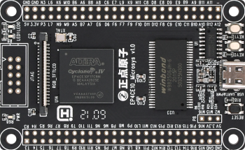
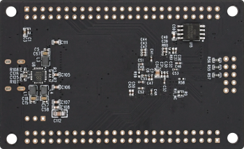

FPGA E10小型系统板
==========================

开发板介绍
----------
- ``开发板综合例程演示视频``：https://www.bilibili.com/video/BV1d64y1v7EF

资料下载链接
------------

资料盘链接
^^^^^^^^^^^

- ``资料盘`` 资料链接A盘：https://pan.baidu.com/s/1L5p-Fbfa5GyjWj9LhGxlIg   提取码：qu1s 
 
- ``工具盘`` 资料链接B盘：https://pan.baidu.com/s/1TPNsYT_KEpDHHoD-bi1LxA  提取码：3uv7

视频网盘链接
^^^^^^^^^^^

-  视频参考 ``手把手教你学FPGA-开拓者之基础篇`` 视频C盘：https://pan.baidu.com/s/13fwKL2xpymFgY6Z28Qm9Bg  提取码：l6xz

-  视频参考 ``手把手教你学FPGA-开拓者之中级篇`` 视频D盘：https://pan.baidu.com/s/1SFkbrxFjhWvaMoSrg3N1nw  提取码：ujun  

-  视频参考 ``手把手教你学FPGA-开拓者之高级篇`` 视频E盘：https://pan.baidu.com/s/1ZydPzKz5r6MLCJqtclFodA  提取码：lm53 
   
-  视频参考 ``手把手教你学FPGA-开拓者之NiosII篇`` 视频F盘：https://pan.baidu.com/s/1oCWPg_b5QEbfDWpoRbzY4Q  提取码：n9d0  

视频在线学习平台
^^^^^^^^^^^^^^^^^

- 视频网盘如果失效，请移步在线观看平台：

1. 原子哥在线教学平台免费观看: https://www.yuanzige.com
#. B站哔哩哔哩：https://space.bilibili.com/394620890
#. 腾讯课堂：https://ke.qq.com/course/278479

产品讨论帖
^^^^^^^^^^^^^^^^^

-  E10小型系统板产品讨论贴: http://www.openedv.com/thread-325043-1-1.html

-  E10小型系统板交流群：994244016

产品图片
--------

- E10小型系统板主图如下所示

.. _pic_major_zDSC_2796:

   
 E10小型系统板正面图

 .. _pic_major_bDSC_2798:

   
 E10小型系统板背面图

产品问题答疑
------------

- 阿里旺旺：https://openedv.taobao.com 上淘宝直接一对一咨询技术。  
- 开源电子网【论坛】：http://www.openedv.com/forum.php 
- QQ群：http://www.openedv.com/forum.php   点击首页“官方QQ群”即可加入最新群。 
- 微信群：http://www.openedv.com/forum.php 点击首页“微信群”即可加入最新群。
  

关于正点原子  
-----------------

 | :ref:`公司简介` 
 | :ref:`联系方式`

