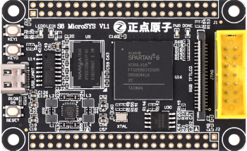
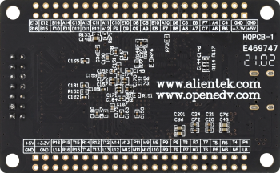

FPGA S6小型系统板
==========================

开发板介绍
----------
- ``开发板综合例程演示视频``：https://www.bilibili.com/video/BV1Y54y1b7Yj

资料下载链接
------------

资料盘链接
^^^^^^^^^^^

- ``资料盘`` 资料链接A盘：https://pan.baidu.com/s/1OMubdolg1iIMK1qZBIx9Tg   提取码：00jw 
 
- ``工具盘`` 资料链接B盘：https://pan.baidu.com/s/1IoLC8NEUd_luOS_HADk7zQ  提取码：1ckv

视频网盘链接
^^^^^^^^^^^

-  视频参考 ``手把手教你学FPGA-超越者`` 视频C盘：https://pan.baidu.com/s/146-rZUU0CG3Y3Th6ZJqxxA  提取码：o0u1

视频在线学习平台
^^^^^^^^^^^^^^^^^

- 视频网盘如果失效，请移步在线观看平台：

1. 原子哥在线教学平台免费观看: https://www.yuanzige.com
#. B站哔哩哔哩：https://space.bilibili.com/394620890
#. 腾讯课堂：https://ke.qq.com/course/278479

产品讨论帖
^^^^^^^^^^^^^^^^^

- S6小型系统板产品讨论贴: http://www.openedv.com/thread-325014-1-1.html

- S6小型系统板交流群：371632356

产品图片
--------

- S6小型系统板主图如下所示

.. _pic_major_s6z:

   
 S6小型系统板正面图

 .. _pic_major_s6b:

   
 S6小型系统板背面图

产品问题答疑
------------

- 阿里旺旺：https://openedv.taobao.com 上淘宝直接一对一咨询技术。  
- 开源电子网【论坛】：http://www.openedv.com/forum.php 
- QQ群：http://www.openedv.com/forum.php   点击首页“官方QQ群”即可加入最新群。 
- 微信群：http://www.openedv.com/forum.php 点击首页“微信群”即可加入最新群。
  

关于正点原子  
-----------------

 | :ref:`公司简介` 
 | :ref:`联系方式`

