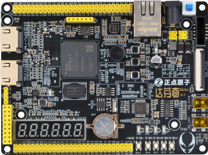

FPGA达芬奇开发板
==========================

资料下载链接
------------

资料盘链接
^^^^^^^^^^^

- ``资料盘`` 资料链接A盘：https://pan.baidu.com/s/1OHAb-5r7fRqN7AITuCatGw    提取码：0k1n 
 
- ``工具盘`` 资料链接B盘：https://pan.baidu.com/s/1xSePUk9xwMS8Mdu5wuucCw  提取码：ycfe

视频网盘链接
^^^^^^^^^^^

-  配套 ``手把手教你学FPGA-达芬奇之基础篇`` 视频C盘：https://pan.baidu.com/s/1FDh4JzYh06cAsjCby2L7fg       提取码：zdyz

视频在线学习平台
^^^^^^^^^^^^^^^^^

- 视频网盘如果失效，请移步在线观看平台：

1. 原子哥在线教学平台免费观看: https://www.yuanzige.com
#. B站哔哩哔哩：https://space.bilibili.com/394620890
#. 腾讯课堂：https://ke.qq.com/course/278479

产品讨论帖
^^^^^^^^^^^^^^^^^

- FPGA达芬奇开发板产品讨论贴: http://www.openedv.com/thread-315192-1-1.html

产品图片
--------

- FPGA达芬奇开发板主图如下所示

.. _pic_major_DSC_0182:

   
 FPGA达芬奇开发板正面图

产品问题答疑
------------

- 阿里旺旺：https://openedv.taobao.com 上淘宝直接一对一咨询技术。  
- 开源电子网【论坛】：http://www.openedv.com 
- QQ群：http://www.openedv.com   点击首页“官方QQ群”即可加入最新群。 
- 微信群：http://www.openedv.com 点击首页“微信群”即可加入最新群。
  

关于正点原子  
-----------------

 | :ref:`公司简介` 
 | :ref:`联系方式`

