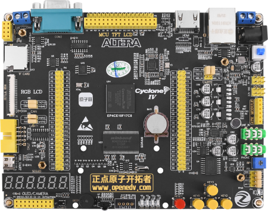
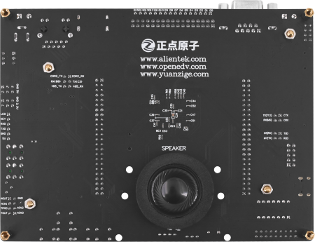

FPGA开拓者V2开发板
==========================

资料下载链接
------------

开发板介绍
----------
- ``开发板综合例程演示视频``：https://www.bilibili.com/video/BV1RP4y1K75Y?spm_id_from=333.999.0.0

资料盘链接
^^^^^^^^^^^

- ``资料盘`` 资料链接A盘：https://pan.baidu.com/s/1xC0eryULXjwGKERJQSB34g   提取码：07j9 
 
- ``工具盘`` 资料链接B盘：https://pan.baidu.com/s/1w9Z0g5uaLEBw-ep1WE0Srw  提取码：bteq

- ``资料盘`` 视频PPT合集：https://pan.baidu.com/s/1KzSkp-15a_1ITjNhkUhP_A  提取码：x5fw

视频网盘链接
^^^^^^^^^^^

-  配套 ``手把手教你学FPGA-开拓者之基础篇`` 视频C盘：https://pan.baidu.com/s/185CZXd5MD4wNjooV6209rA  提取码：qk9g

-  配套 ``手把手教你学FPGA-开拓者之NiosII篇`` 视频D盘：https://pan.baidu.com/s/1RU_qY_SPATVLnN7npT2dxg  提取码：gjbu  

-  配套 ``手把手教你学FPGA-ALTERA官方视频教程`` 视频E盘：https://pan.baidu.com/s/1xx_4i_uET1sUo_a1VaIwBw  提取码：8sma 
   

视频在线学习平台
^^^^^^^^^^^^^^^^^

- 视频网盘如果失效，请移步在线观看平台：

1. 原子哥在线教学平台免费观看: https://www.yuanzige.com
#. B站哔哩哔哩：https://space.bilibili.com/394620890
#. 腾讯课堂：https://ke.qq.com/course/278479

产品讨论帖
^^^^^^^^^^^^^^^^^

- FPGA开拓者V2开发板产品讨论贴: http://www.openedv.com/thread-334389-1-1.html

- 正点原子开拓者FPGA开发板交流群：994244016

产品图片
--------

- FPGA开拓者V2开发板主图如下所示

.. _pic_major_DSC_0481v2:

   
 FPGA开拓者V2开发板正面图

.. _pic_major_DSC_0483v2:

   
 FPGA开拓者V2开发板背面图

产品问题答疑
------------

- 阿里旺旺：https://openedv.taobao.com 上淘宝直接一对一咨询技术。  
- 开源电子网【论坛】：http://www.openedv.com/forum.php 
- QQ群：http://www.openedv.com/forum.php   点击首页“官方QQ群”即可加入最新群。 
- 微信群：http://www.openedv.com/forum.php 点击首页“微信群”即可加入最新群。
  

关于正点原子  
-----------------

 | :ref:`公司简介` 
 | :ref:`联系方式`

