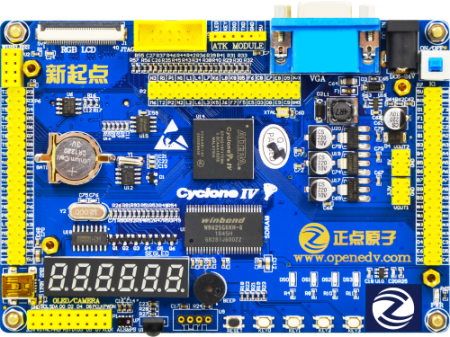

FPGA新起点V1开发板
==========================

开发板介绍
----------
- ``开发板综合例程演示视频``：B站哔哩哔哩链接：https://www.bilibili.com/video/BV1kf4y1v7FT

资料下载链接
------------

资料盘链接
^^^^^^^^^^^

- ``资料盘`` 资料链接A盘：https://pan.baidu.com/s/1L_bobgfjqrXeTPnFWRi4jA 提取码：zdyz
 
- ``工具盘`` 资料链接B盘：https://pan.baidu.com/s/1lWPzHaDmAmqQwG5UZEaJ0w   提取码：f0r0   

- ``资料盘`` 视频PPT合集：https://pan.baidu.com/s/1094eOuLSjofI5P6viHANFA  提取码：1zmt

视频网盘链接
^^^^^^^^^^^

-  配套 ``手把手教你学FPGA-新起点之基础篇`` 视频C盘：https://pan.baidu.com/s/18pVvGVeZxMo1zeDWTXir4A  提取码：2svp

-  配套 ``手把手教你学FPGA-新起点之中级篇`` 视频D盘：https://pan.baidu.com/s/19s9vWVTQBPvAy6B9ZIZcNg  提取码：pc68  

-  配套 ``手把手教你学FPGA-新起点之高级篇`` 视频E盘：https://pan.baidu.com/s/1Kl-w7jfyP3Dz3PvtAASPew  提取码：hpg2 
   
-  配套 ``手把手教你学FPGA-新起点之NiosII篇`` 视频F盘：https://pan.baidu.com/s/1jEnOsIdziv-_ykwgsTtaoQ  提取码：50hn  
      

视频在线学习平台
^^^^^^^^^^^^^^^^^

- 视频网盘如果失效，请移步在线观看平台：

1. 原子哥在线教学平台免费观看: https://www.yuanzige.com
#. B站哔哩哔哩：https://space.bilibili.com/394620890
#. 腾讯课堂：https://ke.qq.com/course/278479

产品讨论帖
^^^^^^^^^^^^^^^^^

- FPGA新起点开发板产品讨论贴: http://www.openedv.com/thread-281145-1-1.html

- 正点原子新起点FPGA开发板交流群：994244016

产品图片
--------

- FPGA新起点开发板主图如下所示

.. _pic_major_DSC_0472:

   
 FPGA新起点开发板正面图

.. _pic_major_DSC_0477:

.. figure:: media/DSC_0477.png

   
 FPGA新起点开发板背面图

产品问题答疑
------------

- 阿里旺旺：https://openedv.taobao.com 上淘宝直接一对一咨询技术。  
- 开源电子网【论坛】：http://www.openedv.com/forum.php 
- QQ群：http://www.openedv.com/forum.php   点击首页“官方QQ群”即可加入最新群。 
- 微信群：http://www.openedv.com/forum.php 点击首页“微信群”即可加入最新群。
  

关于正点原子  
-----------------

 | :ref:`公司简介` 
 | :ref:`联系方式`

