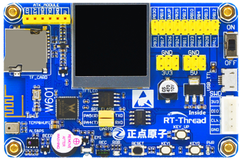

W601 IoT开发板
==========================

开发板介绍
----------
- ``开发板综合例程演示视频``：B站哔哩哔哩链接：https://www.bilibili.com/video/BV1pa4y1W7f1

资料下载链接
------------

资料盘链接
^^^^^^^^^^^

- ``资料盘`` 开发板资料链接：https://pan.baidu.com/s/1mYG-KVdTOWA7PX_RokKNiw 提取码：5wi8 

      

视频在线学习平台
^^^^^^^^^^^^^^^^^

1. 原子哥在线教学平台免费观看: https://www.yuanzige.com
#. B站哔哩哔哩免费观看：https://space.bilibili.com/394620890
#. 腾讯课堂免费观看：https://ke.qq.com/course/278479

产品讨论帖
^^^^^^^^^^^^^^^^^

- W601 IoT开发板产品讨论贴: http://www.openedv.com/thread-308978-1-1.html 

- 正点原子技术交流群：905624739

产品图片
--------

- W601 IoT开发板主图如下所示

.. _pic_major_w601:

   
 W601 IoT开发板实物图正面

购买方式
--------

- 正点原子官方淘宝店：https://openedv.taobao.com 

产品问题答疑
------------

- 阿里旺旺：https://openedv.taobao.com 上淘宝直接一对一咨询技术。  
- 开源电子网【论坛】：http://www.openedv.com/forum.php 
- QQ群：http://www.openedv.com/forum.php   点击首页“官方QQ群”即可加入最新群。 
- 微信群：http://www.openedv.com/forum.php 点击首页“微信群”即可加入最新群。
  

关于正点原子  
-----------------

 | :ref:`公司简介` 
 | :ref:`联系方式`

