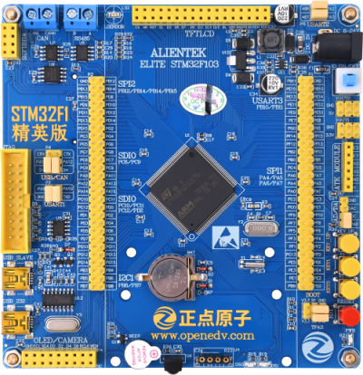

stm32f103精英开发板
==========================

开发板介绍
----------
- ``开发板综合例程演示视频``：B站哔哩哔哩链接：https://www.bilibili.com/video/BV1qV411t785

资料下载链接
------------

资料盘链接
^^^^^^^^^^^

-  ``资料盘`` 开发板资料A盘：https://pan.baidu.com/s/18y_69vS5ROFgxPe3mmC4-w  提取码：xva4

-  ``资料盘`` 视频PPT合集：https://pan.baidu.com/s/1pHyHJWhdZl9Lf2Wo7Q3DBQ  提取码：kkil  

视频网盘链接
^^^^^^^^^^^

-  配套 ``手把手教你学STM32-M3入门篇`` 视频B盘：https://pan.baidu.com/s/1OZYAyxKBQ1mh8IJRtOYD0A 提取码：00wg

-  配套 ``手把手教你学STM32-M3中级篇`` 视频C盘：https://pan.baidu.com/s/1vv9gjV9SUYmFuTbrq-ixYg 提取码：vszw 

-  配套 ``手把手教你学STM32-M3高级篇`` 视频D盘：https://pan.baidu.com/s/1c4iIR8OlkwSuabIGdJ6khg 提取码：or67

-  配套 ``FreeRTOS实时系统`` 视频链接：https://pan.baidu.com/s/1bEaivOli460zbI7Xn7OM1g 提取码：lytx
   
-  配套 ``UcosIII-实时系统`` 视频链接：https://pan.baidu.com/s/15Rt5mj1Z1ZXwxf4aUyLAGg 提取码：iuma   

-  配套 ``STenwin-图形界面`` 视频链接：https://pan.baidu.com/s/1QL9RSaOyX6zvKqF0hQcWhw 提取码：fa8z

-  配套 ``LWIP网络通信编程`` 视频链接：https://pan.baidu.com/s/1FruKtxfOe_bTJ2EPEN20Rg 提取码：ywf5

-  配套 ``LittleVGL开源图形界面`` 视频链接：https://pan.baidu.com/s/16xspIfFJSKCL7y_JU_HSgw 提取码：4xri
      

视频在线学习平台
^^^^^^^^^^^^^^^^^
- 视频网盘经常失效，请移步在线观看平台：

1. 原子哥在线教学平台免费观看: https://www.yuanzige.com
#. B站哔哩哔哩免费观看：https://space.bilibili.com/394620890
#. 腾讯课堂免费观看：https://ke.qq.com/course/278479

产品讨论帖
^^^^^^^^^^^^^^^^^

- stm32f103精英开发板产品讨论贴: http://www.openedv.com/thread-308946-1-1.html

- 正点原子STM32技术交流群:10472381988

产品图片
--------

- stm32f103精英开发板主图如下所示

.. _pic_major_5640_Z:

   
 stm32f103精英开发板实物图正面

购买方式
--------

- 正点原子官方淘宝店：https://openedv.taobao.com 

产品问题答疑
------------

- 阿里旺旺：https://openedv.taobao.com 上淘宝直接一对一咨询技术。  
- 开源电子网【论坛】：http://www.openedv.com 
- QQ群：http://www.openedv.com   点击首页“官方QQ群”即可加入最新群。 
- 微信群：http://www.openedv.com 点击首页“微信群”即可加入最新群。
  

关于正点原子  
-----------------

 | :ref:`公司简介` 
 | :ref:`联系方式`

