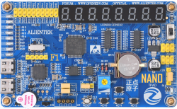
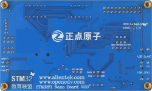

stm32f103-nano开发板
==========================

资料下载链接
------------

资料盘链接
^^^^^^^^^^^

- ``资料盘`` 开发板资料链接：https://pan.baidu.com/s/1pq2A4cYlpTDNo4R7ubNQLQ 提取码：a431   

视频网盘链接
^^^^^^^^^^^

-  配套 ``手把手教你学STM32-M3入门篇`` 视频链接：https://pan.baidu.com/s/1RmvKl6HGtalBAt95ZRLrKg 提取码：3gdu

-  配套 ``手把手教你学STM32-M3中级篇`` 视频链接：https://pan.baidu.com/s/1F1S_hyQuKIruPB7weICcrw 提取码：98d0  

-  配套 ``手把手教你学STM32-M3高级篇`` 视频链接：https://pan.baidu.com/s/1vyfgznJjBkm8dryl5nFlbg 提取码：6w2g 

-  配套 ``FreeRTOS实时系统`` 视频链接：https://pan.baidu.com/s/1TgemZkCjfcer5-Vz0tVcAA 提取码：57xe
   
-  配套 ``UcosIII-实时系统`` 视频链接：https://pan.baidu.com/s/1_gF3jO6kWyChuRRGIynCOg 提取码：6mge   

-  配套 ``STenwin-图形界面`` 视频链接：https://pan.baidu.com/s/1971Uekb6iAPKGYUgt_USzA 提取码：mz1t

-  配套 ``LWIP网络通信编程`` 视频链接：https://pan.baidu.com/s/1kxCrU6myt17UrjoXNot6ng 提取码：xgo8

      

视频在线学习平台
^^^^^^^^^^^^^^^^^
- 视频网盘经常失效，请移步在线观看平台：

1. ``原子哥在线教学平台`` 免费观看: https://www.yuanzige.com
#. B站哔哩哔哩：https://space.bilibili.com/394620890
#. 腾讯课堂：https://ke.qq.com/course/278479

产品讨论帖
^^^^^^^^^^^^^^^^^

- stm32f103-nano开发板产品讨论贴:  http://www.openedv.com/thread-308971-1-1.html

产品图片
--------

- stm32f103-nano开发板主图如下所示

.. _pic_major_stm32f103_nano:

   
  stm32f103-nano开发板实物图正面

.. _pic_major_stm32f103b_nano:

   
  stm32f103-nano开发板实物图背面

购买方式
--------

- 正点原子官方淘宝店：https://openedv.taobao.com 

产品问题答疑
------------

- 阿里旺旺：https://openedv.taobao.com 上淘宝直接一对一咨询技术。  
- 开源电子网【论坛】：http://www.openedv.com 
- QQ群：http://www.openedv.com   点击首页“官方QQ群”即可加入最新群。 
- 微信群：http://www.openedv.com 点击首页“微信群”即可加入最新群。
  

关于正点原子  
-----------------

 | :ref:`公司简介` 
 | :ref:`联系方式`

