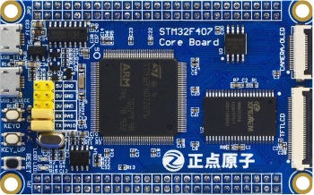
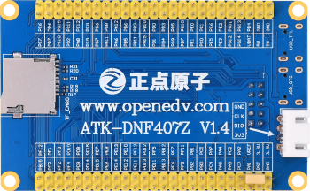

stm32f407最小系统板
==========================

资料下载链接
------------

资料盘链接
^^^^^^^^^^^

- ``资料盘`` 开发板资料链接：https://pan.baidu.com/s/1ZD1v2gl2yNgYocGLwG3fGQ 提取码：z1zt 

视频网盘链接
^^^^^^^^^^^

-  配套 ``手把手教你学STM32-M4入门篇`` 视频链接：https://pan.baidu.com/s/1CClMcY7d7SAEe-CZaHRoUg 提取码：u4w5

-  配套 ``手把手教你学STM32-M4中级篇`` 视频链接：https://pan.baidu.com/s/147LySRrrZSLWlv6HHaC5Mw 提取码：q8t4

-  配套 ``手把手教你学STM32-M4高级篇`` 视频链接：https://pan.baidu.com/s/1YsSaxmfF8QXZYF4fNqEjyg 提取码：w4k6

-  配套 ``FreeRTOS实时系统`` 视频链接：https://pan.baidu.com/s/1bEaivOli460zbI7Xn7OM1g 提取码：lytx
   
-  配套 ``UcosIII-实时系统`` 视频链接：https://pan.baidu.com/s/1aq0r29epw8Diz3s0CSOT3w 提取码：m2tz   

-  配套 ``STenwin-图形界面`` 视频链接：https://pan.baidu.com/s/1FTbeAfRrW33Jvky7ZXI2vg 提取码：ttg6

-  配套 ``LWIP网络通信编程`` 视频链接：https://pan.baidu.com/s/1LwLyr95R-020gAF_xmLQZg 提取码：san0
  

视频在线学习平台
^^^^^^^^^^^^^^^^^
- 视频网盘经常失效，请移步在线观看平台：

1. 原子哥在线教学平台免费观看: https://www.yuanzige.com
#. B站哔哩哔哩：https://space.bilibili.com/394620890
#. 腾讯课堂：https://ke.qq.com/course/278479

产品讨论帖
^^^^^^^^^^^^^^^^^

- stm32f407最小系统板产品讨论贴: http://www.openedv.com/thread-308934-1-1.html 

产品图片
--------

- stm32f407最小系统板主图如下所示

.. _pic_major_F407z:

   
 stm32f407最小系统板实物图正面

.. _pic_major_F407b:

   
  stm32f407最小系统板实物图背面

购买方式
--------

- 正点原子官方淘宝店：https://openedv.taobao.com 

产品问题答疑
------------

- 阿里旺旺：https://openedv.taobao.com 上淘宝直接一对一咨询技术。  
- 开源电子网【论坛】：http://www.openedv.com 
- QQ群：http://www.openedv.com   点击首页“官方QQ群”即可加入最新群。 
- 微信群：http://www.openedv.com 点击首页“微信群”即可加入最新群。
  

关于正点原子  
-----------------

 | :ref:`公司简介` 
 | :ref:`联系方式`

