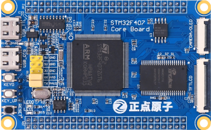

stm32f407最小系统板
==========================

开发板介绍
----------
- ``开发板综合例程演示视频``：B站哔哩哔哩链接：https://www.bilibili.com/video/BV19V411a7Qf

资料下载链接
------------

资料盘链接
^^^^^^^^^^^

- ``资料盘`` 开发板资料A盘：https://pan.baidu.com/s/1vNF3yRS3IgOWUAkHvgJl5w  提取码：f7ik 

- ``资料盘`` 视频PPT合集：https://pan.baidu.com/s/1lsE71LRUQx21czKxDU7WEg  提取码：hrq4  

视频网盘链接
^^^^^^^^^^^

-  配套 ``手把手教你学STM32-M4入门篇`` 视频链接：https://pan.baidu.com/s/1y32Wdmg38O5lJrcw5OKApw 提取码：6649

-  配套 ``手把手教你学STM32-M4中级篇`` 视频链接：https://pan.baidu.com/s/14_8WMcb2Bc0nvxz3KfIeMw 提取码：sbg2

-  配套 ``手把手教你学STM32-M4高级篇`` 视频链接：https://pan.baidu.com/s/11cc_ggU46s6ypnFjwAZe5Q 提取码：a1gr

-  配套 ``FreeRTOS实时系统`` 视频链接：https://pan.baidu.com/s/1HpkImWCS16sxWFOjmcVNhA 提取码：dfjs
   
-  配套 ``UcosIII-实时系统`` 视频链接：https://pan.baidu.com/s/1ASR_TPGcZsWtVXs0VfgpWQ  提取码：8h3n   

-  配套 ``STenwin-图形界面`` 视频链接：https://pan.baidu.com/s/1Er1lfmbJK5Ti-Pm8qIKH6A 提取码：mvwb

-  配套 ``LWIP网络通信编程`` 视频链接：https://pan.baidu.com/s/1FruKtxfOe_bTJ2EPEN20Rg 提取码：ywf5

-  配套 ``LittleVGL开源图形界面`` 视频链接：https://pan.baidu.com/s/1-7RFskvZifndQUSzQ4D92Q 提取码：zdyz
      
视频在线学习平台
^^^^^^^^^^^^^^^^^
- 视频网盘经常失效，请移步在线观看平台：

1. 原子哥在线教学平台免费观看: https://www.yuanzige.com
#. B站哔哩哔哩：https://space.bilibili.com/394620890
#. 腾讯课堂：https://ke.qq.com/course/278479

产品讨论帖
^^^^^^^^^^^^^^^^^

- stm32f407最小系统板产品讨论贴: http://www.openedv.com/thread-308934-1-1.html 

- 正点原子STM32技术交流群:756580169

产品图片
--------

- stm32f407最小系统板主图如下所示

.. _pic_major_F407z:

   
 stm32f407最小系统板实物图正面

.. _pic_major_F407b:

   
  stm32f407最小系统板实物图背面

购买方式
--------

- 正点原子官方淘宝店：https://openedv.taobao.com 

产品问题答疑
------------

- 阿里旺旺：https://openedv.taobao.com 上淘宝直接一对一咨询技术。  
- 开源电子网【论坛】：http://www.openedv.com/forum.php 
- QQ群：http://www.openedv.com/forum.php   点击首页“官方QQ群”即可加入最新群。 
- 微信群：http://www.openedv.com/forum.php 点击首页“微信群”即可加入最新群。
  

关于正点原子  
-----------------

 | :ref:`公司简介` 
 | :ref:`联系方式`

