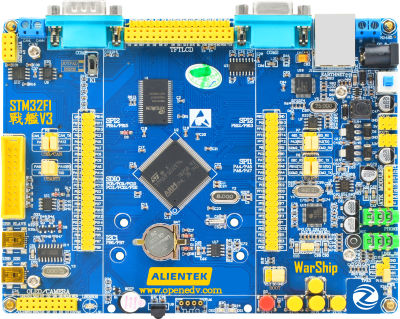

stm32f429阿波罗开发板
==========================

资料下载链接
------------

正点原子stm32f103战舰开发板资料链接：

- ``资料盘`` 文件夹包链接：https://pan.baidu.com/s/1L3XLJWVBeBUkzfsiwViFYg   提取码 ：q0uc  
 
- ``资料盘`` 独立压缩包链接：https://pan.baidu.com/s/1uqVc1kWU1goRb79RATh3zg   提取码 rn40   

-  视频盘 链接：

   -  配套 ``手把手教你学STM32-M3入门篇`` 视频链接： http://pan.baidu.com/s/1i5GwEqT  提取码：无

   -  配套 ``手把手教你学STM32-M3中级篇`` 链接：https://pan.baidu.com/s/1KTOvWMqw52h5ZgOc__qw-w  提取码：y035  

   -  配套 ``手把手教你学STM32-M3提高篇`` 链接： https://pan.baidu.com/s/1k7RIxTwTy5L5B9K1gQTq8g  提取码：gt0n 

   -  配套 ``FreeRTOS`` 视频链接：https://pan.baidu.com/s/133A1l68GXbMAhjWdGOmX7g 提取码：无

   -  配套 ``LWIP`` 视频链接： http://pan.baidu.com/s/1eSsMB3G  提取码：无

   -  配套 ``UCOS`` 视频链接： http://pan.baidu.com/s/1dFkbkMP  提取码：无

   -  配套 ``EMWIN`` 视频链接：http://pan.baidu.com/s/1c29LDj6  提取码：无
      

视频网盘经常失效，请移步在线观看平台：

1. ``原子哥在线教学平台`` 免费观看: https://www.yuanzige.com
#. B站哔哩哔哩：https://space.bilibili.com/394620890
#. 腾讯课堂：https://ke.qq.com/course/278479

产品图片
--------

stm32f103战舰开发板主图如 :numref:`pic_major` 所示。

.. _pic_major:

   stm32f429阿波罗开发板

    