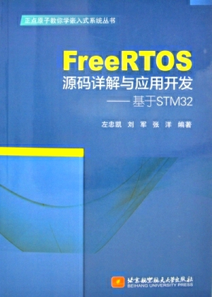

《FreeRTOS源码与应用》
================================================

资料下载链接
------------

《FreeRTOS源码详解与应用开发》系列教程及代码适用于正点原子STM32开发板，可根据需要选择下载。

- 链接：https://pan.baidu.com/s/1hFtCCo_PV85kFnFGudM7bg  提取码：4rub
  

视频在线学习平台
^^^^^^^^^^^^^^^^^

1. 原子哥在线教学平台免费观看: https://www.yuanzige.com
#. B站哔哩哔哩免费观看：https://space.bilibili.com/394620890
#. 腾讯课堂免费观看：https://ke.qq.com/course/278479

产品图片
--------

《FreeRTOS应用开发与源码详解》书籍封面主图如下所示。

.. _pic_major_free:

   
    《FreeRTOS应用开发与源码详解》书籍封面

购买方式
--------

- 正点原子官方淘宝店：https://openedv.taobao.com 

产品问题答疑
------------

- 阿里旺旺：https://openedv.taobao.com 上淘宝直接一对一咨询技术。  
- 开源电子网【论坛】：http://www.openedv.com/forum.php 
- QQ群：http://www.openedv.com/forum.php   点击首页“官方QQ群”即可加入最新群。 
- 微信群：http://www.openedv.com/forum.php 点击首页“微信群”即可加入最新群。
  

关于正点原子  
-----------------

 | :ref:`公司简介` 
 | :ref:`联系方式`