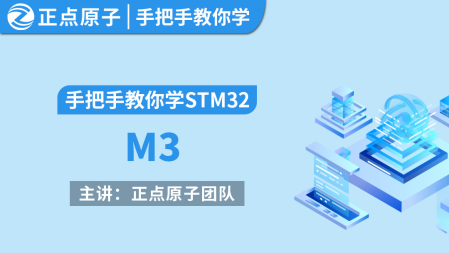

手把手教你学STM32-M3
=================================

资料下载链接
------------

- 链接：https://pan.baidu.com/s/1zJ1crio46X7n-cxRnhRjcQ 提取码：wmcj
  
视频网盘链接
^^^^^^^^^^^

-  配套 ``手把手教你学STM32-M3入门篇`` 视频链接：https://pan.baidu.com/s/1HfhvPRKAY8qIf7BX0tAjMg 提取码：4yh2

-  配套 ``手把手教你学STM32-M3中级篇`` 视频链接：https://pan.baidu.com/s/1eNc1lt2RIRBdtbCvB274HA 提取码：kc7g  

-  配套 ``手把手教你学STM32-M3高级篇`` 视频D盘：https://pan.baidu.com/s/1o4SaHCXXf67pSM1FqRHrBw 提取码：szji

在线教学视频链接
^^^^^^^^^^^^^^^^^^

- 视频网盘经常失效，请移步在线观看平台：

1. 原子哥在线教学平台免费观看: https://www.yuanzige.com
#. B站哔哩哔哩免费观看：https://space.bilibili.com/394620890
#. 腾讯课堂免费观看：https://ke.qq.com/course/278479

产品图片
--------

手把手教你学STM32-M3视频封面主图如下所示。

.. _pic_major_M3:

   
 手把手教你学STM32-M3视频封面

购买方式
--------

- 正点原子官方淘宝店：https://openedv.taobao.com 

产品问题答疑
------------

- 阿里旺旺：https://openedv.taobao.com 上淘宝直接一对一咨询技术。  
- 开源电子网【论坛】：http://www.openedv.com/forum.php 
- QQ群：http://www.openedv.com/forum.php   点击首页“官方QQ群”即可加入最新群。 
- 微信群：http://www.openedv.com/forum.php 点击首页“微信群”即可加入最新群。
  

关于正点原子  
-----------------

 | :ref:`公司简介` 
 | :ref:`联系方式`

