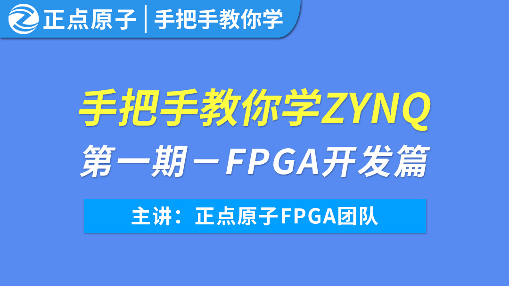

手把手教你学ZYNQ
=================================

资料下载链接
------------

资料盘链接
^^^^^^^^^^^

- ``资料盘`` 资料链接： https://pan.baidu.com/s/1_Jdq8uOpFxfD6y9W8qQpdQ   提取码：8idq  
 
- ``工具盘`` 资料链接： https://pan.baidu.com/s/1IkRckkFVKuLHs7w9fIyOog   提取码：h7bl   

视频网盘链接
^^^^^^^^^^^

-  配套 ``手把手教你学ZYNQ-FPGA开发篇`` 视频C盘：https://pan.baidu.com/s/1ATMmVzBQ7FbVpc6rZLz6Hw   提取码：m5nr

-  配套 ``手把手教你学ZYNQ-嵌入式开发篇`` 视频D盘：https://pan.baidu.com/s/1iUWGFVQastZel4sBgVMFDQ   提取码：35jt  
  
-  配套 ``手把手教你学ZYNQ-嵌入式LINUX开发篇`` 视频E盘：https://pan.baidu.com/s/1nTuRa_pXXhdWDwhhY0wk3w   提取码：gmkw      

视频在线学习平台
^^^^^^^^^^^^^^^^^

- 视频网盘如果失效，请移步在线观看平台：

1. 原子哥在线教学平台免费观看: https://www.yuanzige.com
#. B站哔哩哔哩：https://space.bilibili.com/394620890
#. 腾讯课堂：https://ke.qq.com/course/278479

产品图片
--------

手把手教你学ZYNQ视频封面主图如下所示。

.. _pic_major_ZYNQ:

   
 手把手教你学ZYNQ视频封面

产品问题答疑
------------

- 阿里旺旺：https://openedv.taobao.com 上淘宝直接一对一咨询技术。  
- 开源电子网【论坛】：http://www.openedv.com/forum.php 
- QQ群：http://www.openedv.com/forum.php   点击首页“官方QQ群”即可加入最新群。 
- 微信群：http://www.openedv.com/forum.php 点击首页“微信群”即可加入最新群。
  

关于正点原子  
-----------------

 | :ref:`公司简介` 
 | :ref:`联系方式`

