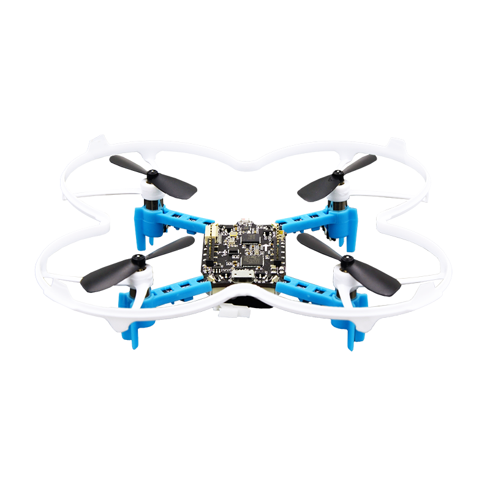

.. 正点原子产品资料汇总, created by 2020-03-19 正点原子-alientek.

MiniFly四轴飞行器
=========================

MiniFly是正点原子最新推出的一款开源微型四轴飞行器，该四轴飞行器主要有以下特点：
 - 开源，可二次开发；
 - 支持定高飞行、 手动飞行以及定点飞行（搭配光流模块） ；
 - 支持 4D 空翻；
 - 支持抛飞；
 - 支持有头（X 模式） 和无头模式飞行；
 - 支持一键起飞，一键降落；
 - 支持手机 WIFI 控制，拍照和视频录制（搭配 wifi 摄像头模块） ；
 - 支持 USB 固件升级；
 - 支持多种扩展模块；
   

试飞效果视频链接
------------  

- 链接： http://www.openedv.com/forum.php?mod=viewthread&tid=98585

资料下载链接
------------

MiniFly四轴飞行器资料链接：

- 链接： https://pan.baidu.com/s/1ScpiDOfuZsz2YxTTcoBObA  提取码：zleg  

产品图片
--------

   :align: center

    正点原子MiniFly四轴飞行器

