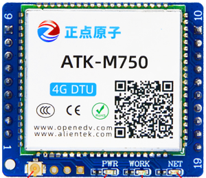

.. 正点原子产品资料汇总, created by 2020-03-19 正点原子-alientek 

4G DTU通信模块ATK-M750
============================================

模块介绍
----------

- ``模块使用教程`` B站哔哩哔哩链接：https://www.bilibili.com/video/BV1uP4y187bw?

资料链接
------------

模块使用资料
^^^^^^^^^^

- 资料链接：https://pan.baidu.com/s/1JS33euVXYP3_bjZ6MDwq6Q
- 提取码：056y
  

  
产品讨论帖
^^^^^^^^^^

- 4GDTU通信模块ATK-M750产品讨论贴: http://www.openedv.com/thread-308544-1-1.html

- 正点原子2G/4G DTU模块交流群：811175957

产品图片
--------

- 4GDTU通信模块ATK-M750主图如下所示

.. _pic_major_m750:

   
  4GDTU通信模块ATK-M750实物图正面

.. _pic_major_m7501:

.. figure:: media/m7501.png

   
  4GDTU通信模块ATK-M750实物图背面

购买方式
-------- 

- 正点原子官方淘宝店：https://openedv.taobao.com 

产品问题答疑
------------

- 阿里旺旺：https://openedv.taobao.com 上淘宝直接一对一咨询技术。  
- 开源电子网【论坛】：http://www.openedv.com/forum.php 
- QQ群：http://www.openedv.com/forum.php   点击首页“官方QQ群”即可加入最新群。 
- 微信群：http://www.openedv.com/forum.php 点击首页“微信群”即可加入最新群。
  

关于正点原子  
-----------------

 | :ref:`公司简介` 
 | :ref:`联系方式`

