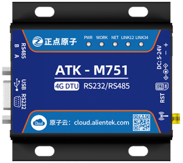

.. 正点原子产品资料汇总, created by 2020-03-19 正点原子-alientek 

4G DTU通信模块ATK-M751
============================================

产品介绍
----------

- ``产品展示视频`` B站哔哩哔哩链接：https://www.bilibili.com/video/BV1tA41147or

资料链接
------------

模块使用资料
^^^^^^^^^^

- 资料链接：https://pan.baidu.com/s/1TYHhp0znrp0WTyjsHvj5_A 
- 提取码：inus
  
产品讨论帖
^^^^^^^^^^

- 4G DTU通信ATK-M751产品讨论贴: http://www.openedv.com/thread-301504-1-1.html

- 正点原子2G/4G DTU模块交流群：811175957

产品图片
--------

- 4G DTU通信ATK-M751主图如下所示

.. _pic_major_m7510:

   
  4G DTU通信ATK-M751实物图正面

.. _pic_major_m751:

   
  4G DTU通信ATK-M751实物图左侧面

.. _pic_major_m7512:

   
  4G DTU通信ATK-M751实物图右侧面

购买方式
-------- 

- 正点原子官方淘宝店：https://openedv.taobao.com 

产品问题答疑
------------

- 阿里旺旺：https://openedv.taobao.com 上淘宝直接一对一咨询技术。  
- 开源电子网【论坛】：http://www.openedv.com 
- QQ群：http://www.openedv.com   点击首页“官方QQ群”即可加入最新群。 
- 微信群：http://www.openedv.com 点击首页“微信群”即可加入最新群。
  

关于正点原子  
-----------------

 | :ref:`公司简介` 
 | :ref:`联系方式`

