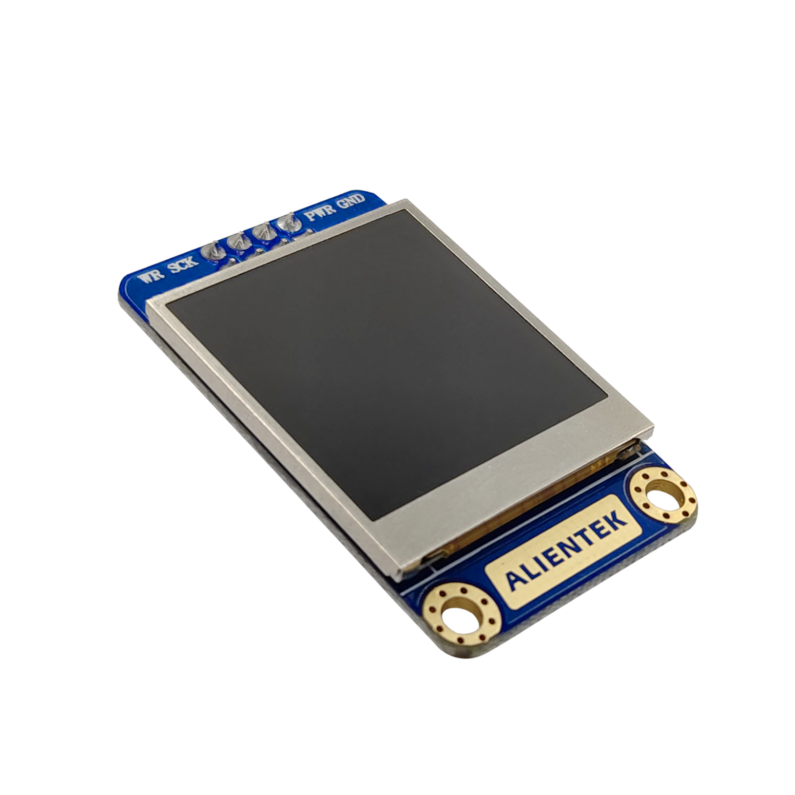

ATK-1.3-TFTLCD液晶屏模块资料
=====================================

ATK-1.3 TFTLCD是ALIENTEK推出的一款高性能1.3寸液晶显示模块。该模块分辨率高达240*240，支持16位真彩色显示，采用ST7789V2驱动，该芯片自带RAM，无需外加驱动器，单片机只需要使用SPI接口就可以轻易驱动该液晶屏幕。

资料链接
------------

模块使用资料
^^^^^^^^^^

- 链接：https://pan.baidu.com/s/122h80H2B93dDTLQD_XFTHw  提取码：wik5 
  
产品讨论帖
^^^^^^^^^^  

ATK-1.3-TFTLCD液晶屏模块产品讨论贴: http://www.openedv.com   

产品图片
--------

ATK-1.3寸TFTLCD液晶屏模块主图如 :numref:`pic_major_1_3TFTLCD` 所示。

.. _pic_major_1_3TFTLCD:

   ATK-1.3寸TFTLCD液晶屏模块

购买方式
-------- 

正点原子官方淘宝店：https://openedv.taobao.com 

产品问题答疑
------------

- 阿里旺旺：https://openedv.taobao.com 上淘宝直接一对一咨询技术。  
- 开源电子网【论坛】：http://www.openedv.com 
- QQ群：http://www.openedv.com   点击首页“官方QQ群”即可加入最新群。 
- 微信群：http://www.openedv.com 点击首页“微信群”即可加入最新群。
  

关于正点原子  
-----------------

 | :ref:`公司简介` 
 | :ref:`联系方式`   

