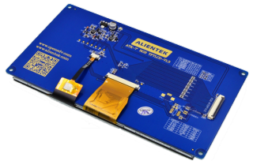

7寸RGBLCD电容触摸屏1024*600
=====================================

资料链接
------------

模块使用资料
^^^^^^^^^^

- 资料链接：https://pan.baidu.com/s/13Lvgvj2JXGacr1zwkYXJAg 
- 提取码：t8mh 
 
  
产品讨论帖
^^^^^^^^^^

- 7寸RGBLCD电容触摸屏模块1024*600产品讨论贴: http://www.openedv.com/thread-77925-1-1.html

产品图片
--------

- 7寸RGBLCD电容触摸屏模块1024*600主图如下所示

.. _pic_major_7rgb11111:

.. figure:: media/7rgb11111.png

   
  7寸RGBLCD电容触摸屏模块1024*600实物图正面

.. _pic_major_7rgbb111111:

   
  7寸RGBLCD电容触摸屏模块1024*600实物图背面

购买方式
-------- 

- 正点原子官方淘宝店：https://openedv.taobao.com 

产品问题答疑
------------

- 阿里旺旺：https://openedv.taobao.com 上淘宝直接一对一咨询技术。  
- 开源电子网【论坛】：http://www.openedv.com/forum.php 
- QQ群：http://www.openedv.com/forum.php   点击首页“官方QQ群”即可加入最新群。 
- 微信群：http://www.openedv.com/forum.php 点击首页“微信群”即可加入最新群。
  

关于正点原子  
-----------------

 | :ref:`公司简介` 
 | :ref:`联系方式`

