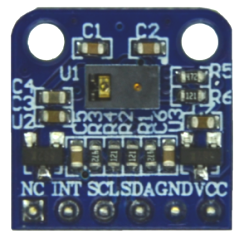

.. 正点原子产品资料汇总, created by 2020-03-19 正点原子-alientek 

手势识别模块ATK-PAJ7620
============================================

模块介绍
----------

- ``模块展示视频`` B站哔哩哔哩链接：https://www.bilibili.com/video/BV1Gf4y1i7Hf

资料链接
------------

模块使用资料
^^^^^^^^^^

- 百度网盘-链接：https://pan.baidu.com/s/1OOYxc2JUrlvaWu_8iA8P5w
- 提取码：tgor
  
产品讨论帖
^^^^^^^^^^

- 手势识别模块ATK-PAJ7620产品讨论贴: http://www.openedv.com/thread-233690-1-1.html

产品图片
--------

- 手势识别模块ATK-PAJ7620主图如下所示

.. _pic_major_paj7620:

   
  手势识别模块ATK-PAJ7620实物图正面

购买方式
-------- 

正点原子官方淘宝店：https://openedv.taobao.com 

产品问题答疑
------------

- 阿里旺旺：https://openedv.taobao.com 上淘宝直接一对一咨询技术。  
- 开源电子网【论坛】：http://www.openedv.com/forum.php 
- QQ群：http://www.openedv.com/forum.php   点击首页“官方QQ群”即可加入最新群。 
- 微信群：http://www.openedv.com/forum.php 点击首页“微信群”即可加入最新群。
  

关于正点原子  
-----------------

 | :ref:`公司简介` 
 | :ref:`联系方式`

