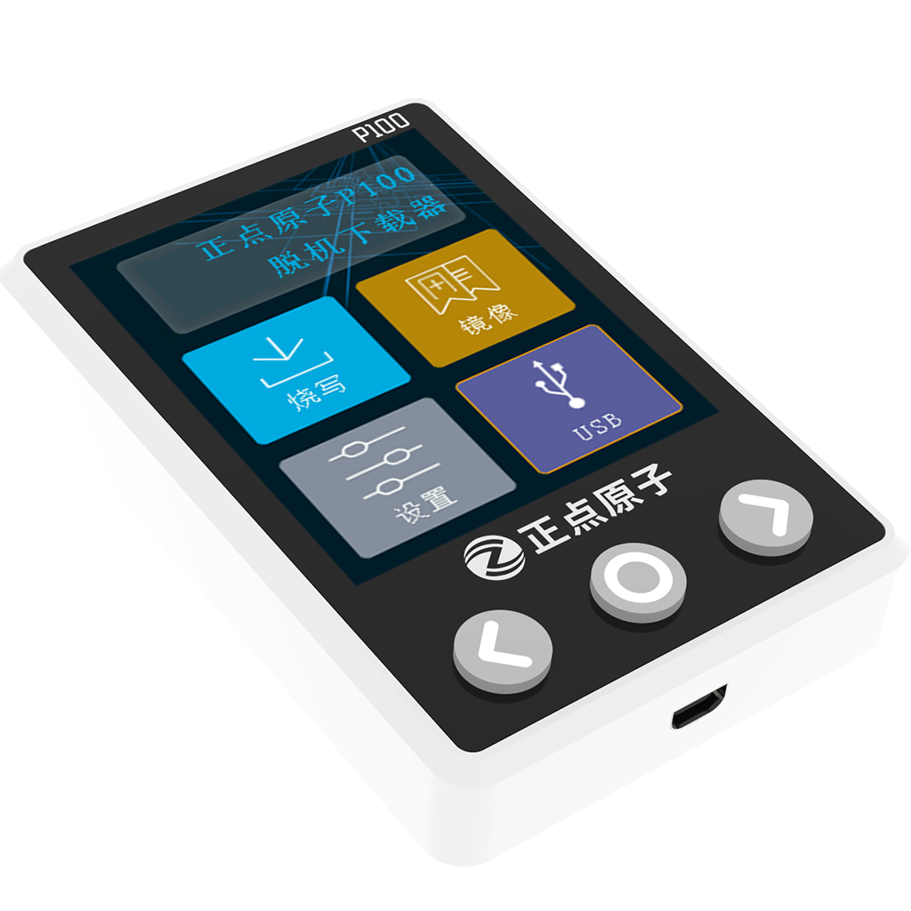

正点原子P100脱机下载器
=================

P100脱机下载器具备比较简洁，酷炫，人性化的界面显示，配备清晰易用的上位。支持存储多个烧写镜像并允许来回切换烧写镜像，方便烧写不同的芯片。通过上位机配置生成烧写镜像时，提供固件程序加密存储，多个固件指定地址烧录、烧录地址重叠查询，多种擦除方式选择，读写保护设置或者解除的功能。同时还提供自动启停烧录、烧录次数、烧录速度、输出电压、UID自定义加密，远程文件等近30种烧录场景当中常用功能。目前支持烧录STM32/GD32/MM32/STM8/N76E/MS51/SPI FLASH等芯片，烧录速度快，稳定性高，使用方便，一键烧录。

资料下载链接
------------

正点原子P100脱机下载器资料链接：

- 百度云链接：https://pan.baidu.com/s/1IURBZm_7XjE6AbcpcS0XoA  提取码：zjsa 

产品图片
--------

   正点原子P100脱机烧录器

