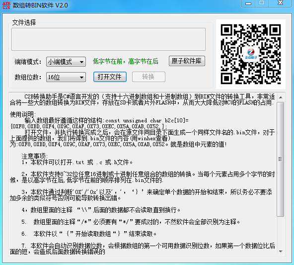

.. 正点原子产品资料汇总, created by 2020-03-19 正点原子-alientek 

数组转BIN软件(ATK-C2B) 版本：v2.2
============================================

资料链接
------------

- 百度网盘-链接：https://pan.baidu.com/s/1nxBTMTe822QdYT5ImyA5oA 
- 提取码：hlwl
  

软件介绍
----------

- 支持.c/.txt/.h文件里面的数组转换成bin文件
- 支持按小端模式/大端模式转换
- 支持混合数据格式数组转换
- 支持自动识别数组类型
- 支持拖拽方式打开文件
- 支持正点原子软件仓库

软件图片
--------

.. _pic_major_T100:

   
  数组转BIN软件界面图

官方店铺
-------- 

正点原子官方淘宝店：https://openedv.taobao.com 

产品问题答疑
------------

- 阿里旺旺：https://openedv.taobao.com 上淘宝直接一对一咨询技术。  
- 开源电子网【论坛】：http://www.openedv.com/forum.php 
- QQ群：http://www.openedv.com/forum.php   点击首页“官方QQ群”即可加入最新群。 
- 微信群：http://www.openedv.com/forum.php 点击首页“微信群”即可加入最新群。
  

关于正点原子  
-----------------

 | :ref:`公司简介` 
 | :ref:`联系方式`

