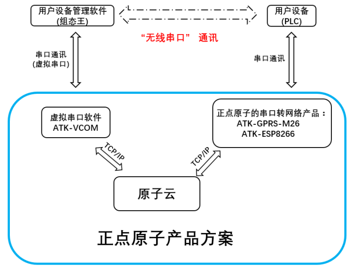
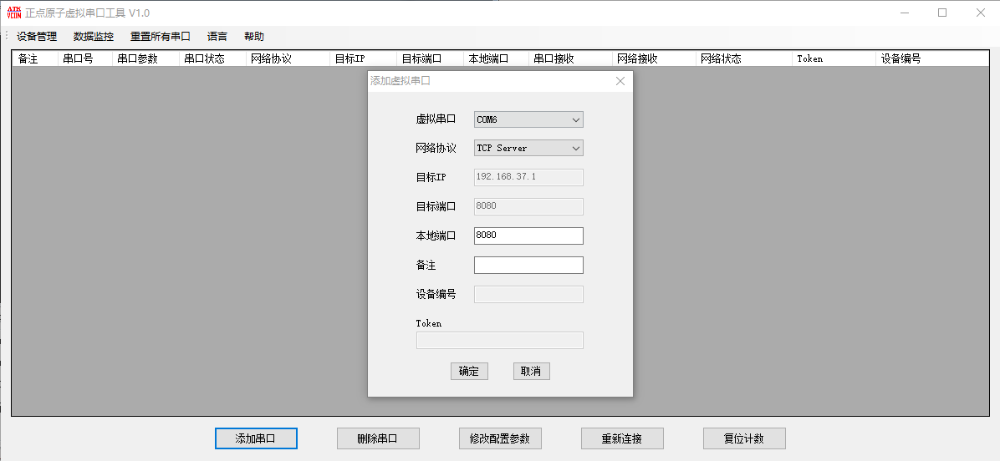

.. 正点原子产品资料汇总, created by 2020-03-19 正点原子-alientek 

虚拟串口软件(ATK-VCOM) 版本：v1.42
============================================

资料链接
------------

- 百度网盘-链接：https://pan.baidu.com/s/1sKq8WaH0fPCOuI_V-PeMAg 
- 提取码：9cr0
  

软件介绍
----------

ATK-VCOM工具是正点原子（ALIENTEK）团队开发的一款将TCP/UDP/原子云服务器映射成PC端虚拟串口的软件。
本软件的主要功能是建立虚拟串口数据与网络数据之间的传输通道，电脑端可以直接调用本软件虚拟出来的串口，以实现与 TCP/UDP/原子云之间的数据传输。最大的特点就是配合正点原子串口转网络产品（目前有ATK-GPRS-M26/ATK-ESP8266/ATK-M750/ATK-M751）以实现用户设备的远程数据传输与控制功能，而用户设备不需要更改原有的有线串口通讯方案，以快速实现远程数据传输方案。

软件图片
--------

.. _pic_major_T100:

   
  虚拟串口软件界面图

官方店铺
-------- 

正点原子官方淘宝店：https://openedv.taobao.com 

产品问题答疑
------------

- 阿里旺旺：https://openedv.taobao.com 上淘宝直接一对一咨询技术。  
- 开源电子网【论坛】：http://www.openedv.com/forum.php 
- QQ群：http://www.openedv.com/forum.php   点击首页“官方QQ群”即可加入最新群。 
- 微信群：http://www.openedv.com/forum.php 点击首页“微信群”即可加入最新群。
  

关于正点原子  
-----------------

 | :ref:`公司简介` 
 | :ref:`联系方式`

