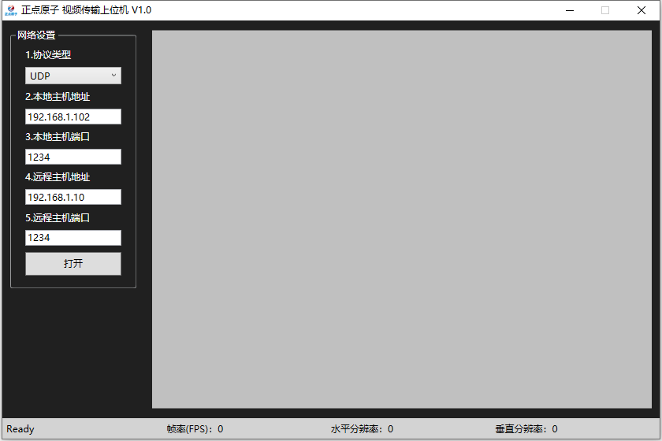

.. 正点原子产品资料汇总, created by 2020-03-19 正点原子-alientek 

串口/网络摄像头软件(ATK-XCAM) 版本：v1.1
============================================

资料链接
------------

- 百度网盘-链接：https://pan.baidu.com/s/17xqfOOzBiYkejwlG-TcwTw 
- 提取码：7ku3
  

软件介绍
----------

- 支持串口接收JPEG数据流并显示，串口波特率可自定义
- 支持网络接收JPEG数据流并显示，支持TCP Server和Client模式
- 支持4种图像显示模式（普通、拉升、居中、放大）
- 支持保存图像截图到指定文件夹
- 支持帧率、帧大小、图片分辨率等信息显示
- 支持简体中文、繁体中文和英文三种语言
- 支持正点原子软件仓库

软件图片
--------

.. _pic_major_T100:

   
  串口/网络摄像头软件界面图

官方店铺
-------- 

正点原子官方淘宝店：https://openedv.taobao.com 

产品问题答疑
------------

- 阿里旺旺：https://openedv.taobao.com 上淘宝直接一对一咨询技术。  
- 开源电子网【论坛】：http://www.openedv.com/forum.php 
- QQ群：http://www.openedv.com/forum.php   点击首页“官方QQ群”即可加入最新群。 
- 微信群：http://www.openedv.com/forum.php 点击首页“微信群”即可加入最新群。
  

关于正点原子  
-----------------

 | :ref:`公司简介` 
 | :ref:`联系方式`

