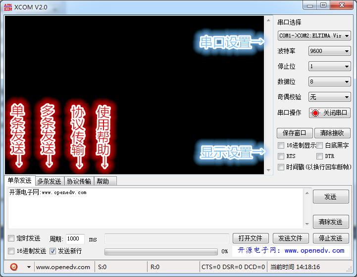
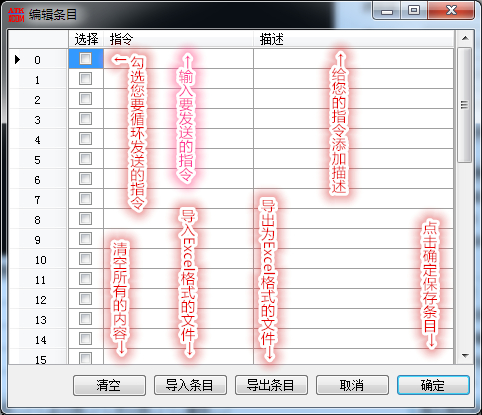
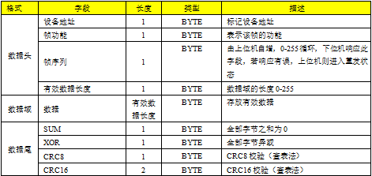
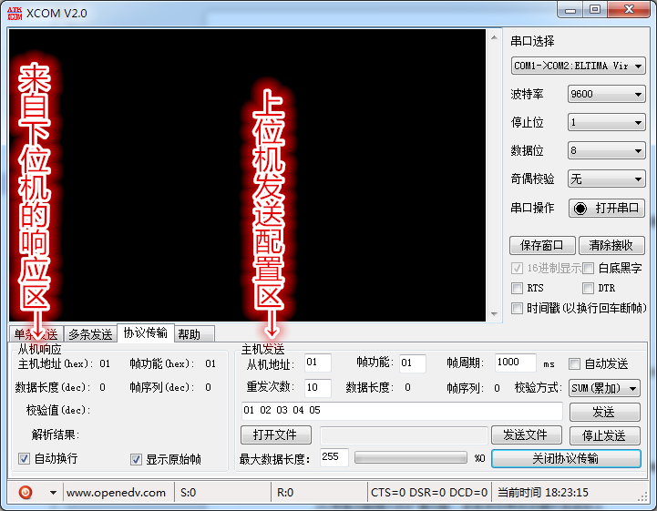
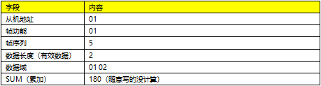
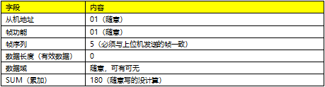
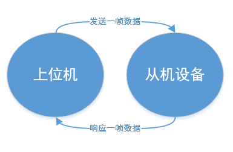
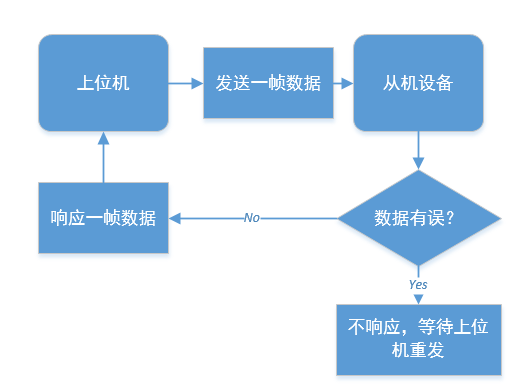

.. 正点原子产品资料汇总, created by 2020-03-19 正点原子-alientek 

串口调试助手软件(ATK-XCOM) 版本：v2.8
============================================

资料链接
------------
- 百度网盘-链接：https://pan.baidu.com/s/1P-GXde1KP9wM_0qzwI2fPQ 
- 提取码：a305

整体功能说明
----------
.. _pic_major_T100:

串口设置
----------
- 软件启动后，会自动搜索可用的串口，可以显示详细的串口信息，由于兼容性原因某些电脑可能不会显示。
- 超高波特率接收，在硬件设别支持的情况下，可自定义波特率，点“自定义”即可输入您想要的波特率，不过需要在串口关闭的情况下，才能修改哦。默认可选波特率为1200bps-1382400bps
- 可以选择为“1、1.5、2”三种停止位.
- 可以选择“5、6、7、8”四种数据长度
- 可选奇，偶校验，或无校验
- 支持串口随时插拔，对于某些硬件设别，由于驱动兼容性的原因可能不支持，实测CH340无问题，建议手动关闭串口

显示设置
----------
- 16进制显示，勾选后将显示16进制的字节，如果之前接收到了数据，会自动转换，所以当接收的数据量比较大的时候，转换会比较慢
- 显示模式设置，默认为黑色背景，绿色字体。勾选“白底黑字”可以将背景设置为白色，字体为黑色
- 通过勾选”RTS”,”DTR”可以控制当前串口的RTS和DTR输出
- 勾选“时间戳”选项，可以加入时间戳显示，需要注意的是，时间戳是以换行回车断帧，所以，当接收到的数据不含“\r\n”换行回车时，此选项是无效的哦。
- 可以保存接收窗口为任意格式的文件，默认为txt格式的文件
- 点击清除接收按钮，可以清除窗口显示的内容，并且清除发送和接收字节计数

单条发送
----------
- 可以在发送区，发送您发送的任意字符
- 支持16进制发送，勾选16进制发送的时候将对发送区的内容进行16进制和字符互转，输入16进制的时候，支持字节自动拆分，不需要每输入一个字节就输入一个空格。也就是说，输不输入空格随你
- 勾选发送新行，将会在发送内容后加入换行回车
- 支持定时发送，可以自定义发送周期
- 支持发送任意格式的文件，可以随时终止文件的发送，可以通过下面的进度条查看发送进度
- 点击发送按钮，即可发送您想发送的内容，支持快捷键“Ctrl+Enter”发送
- 点击清除发送按钮，可以清除发送区的内容，并且清除发送和接收字节计数
- 在状态栏，可以看到发送和接收的字节数，可以读取当前串口“CTS,DSR,DCD”的状态，可以显示当前的系统时间。在状态栏的最左边，有一个开始按钮，可以调出系统计算器，可以恢复软件的默认设置。也可以从这里退出软件
- 点击“开源电子网：www.openedv.com”可以进入到我们的论坛。

多条发送
----------
- 多条发送，适合有多条指令需要发送的场合，比如支持AT指令的设备，蓝牙，GSM,GPS,WIFI等等，配合ALIENTEK的USMART（下载地址：http://www.openedv.com/posts/list/24459.htm）还可以很方便调试代码
- 一共有四页，可以通过“首页，上一页，下一页，尾页”按钮来进行页面的切换
- 勾选发送新行，将会在发送内容后加入换行回车
- 勾选16进制发送，可以支持16进制发送，但是需要注意的是，这里没有进行16进制验证，如果包含非16进制字符，将会导致发送失败
- 勾选关联数字键盘，发送条目0-9将会关联到数字键0-9，在键盘上按下响应的按键即可发送。可以方便控制，比如“智能车”，“飞行器”等等其他设备。在小键盘这里可以看做是方向键哦。
- 支持自动循环发送，可自定义发送周期，需要注意的是，没有勾选的发送条目将不会被发送
- 点击“导入导出条目”按钮可以很方便的编辑，导入导出条目，查看条目的备注，如下图所示：

.. _pic_major_T100:

协议传输
----------
- 此协议是从modbus(rtu)演变而来，可以称之为modbus的变种。协议属于半双工传输的Send-Ack模式，协议自带灵活可配置的自动重发机制，可配置重发次数，重发间隔（即帧周期），多种校验方式，支持校验和，异或，CRC8，CRC16校验，CRC8和CRC16均为查表的方式，效率高,通过这些机制可以有效保证数据的传输质量。支持单次发送，自动发送（自定义周期），文件发送（如，IAP串口升级）三种模式

- 帧格式简要说明

.. _pic_major_T100:

- 协议传输分为，上位机的发送区，和来自下位机的响应区域。如下图所示：
 
.. _pic_major_T100:

- 响应区，可以勾选自动换行，显示将换行，勾选显示原始帧，将显示原始帧而不只显示有效数据部分，可以方便大家调试
- 发送区，可以配置您要发送设备的地址，帧功能，帧周期，是否自动发送，最大重发次数，选择校验方式，以及发送文件
- 在发送文件的时候，可以通过配置最大数据长度来改变每次发送的有效数据长度
- 单次发送，自动发送，文件传输，同一时刻只能使用一种功能。
- 当软件处于重发状态时，可以再次点击发送处来终止发送任务
- 举例说明

上位机发送→
.. _pic_major_T100:

下位机响应→
.. _pic_major_T100:

- 正常的通信流程图

.. _pic_major_T100:

 
- 出现异常通的信流程图

.. _pic_major_T100:

产品问题答疑
------------

- 阿里旺旺：https://openedv.taobao.com 上淘宝直接一对一咨询技术。  
- 开源电子网【论坛】：http://www.openedv.com/forum.php 
- QQ群：http://www.openedv.com/forum.php   点击首页“官方QQ群”即可加入最新群。 
- 微信群：http://www.openedv.com/forum.php 点击首页“微信群”即可加入最新群。
  

关于正点原子  
-----------------

 | :ref:`公司简介` 
 | :ref:`联系方式`