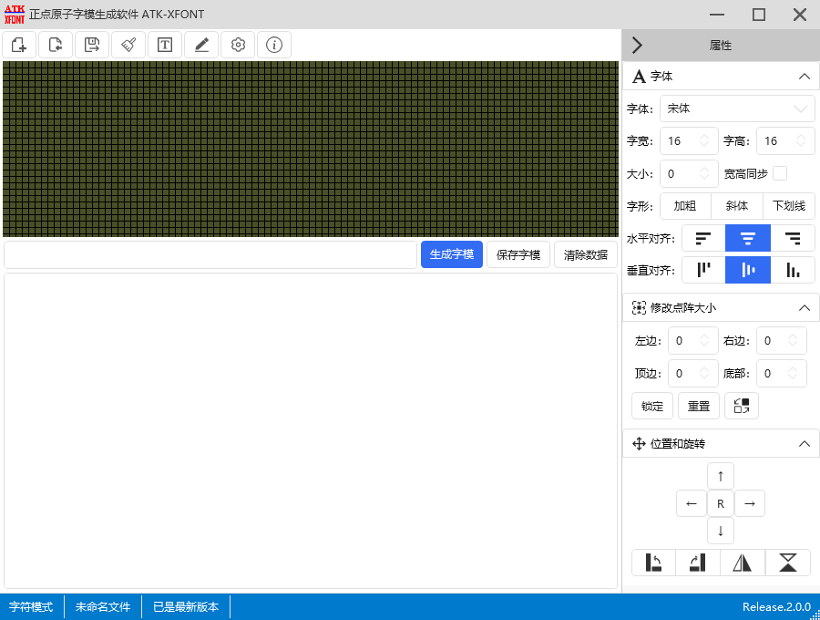

.. 正点原子产品资料汇总, created by 2020-03-19 正点原子-alientek 

字模软件(ATK-XFONT) 版本：v2.0.3
============================================

资料链接
------------

- 百度网盘-链接：https://pan.baidu.com/s/1Osk2whSkC83g6Y-ECuLxiA
- 提取码：wn24
  

软件介绍
----------

- 完全免费使用，无任何限制
- 界面简洁、操作简单、功能强大，支持字符模式、图像模式、字库模式
- 支持点阵的字体、大小、移动、旋转、反相、对齐等各种自定义设置
- 支持手动修改点阵数据
- 支持多种方向取模方式，适合各种使用场景
- 支持C51/A51格式输出
- 字库模式也支持点阵的字体、大小、移动、旋转、反相、对齐等各种自定义
- 支持自动升级功能

软件图片
--------

.. _pic_major_T100:

   
  字模软件软件界面图

官方店铺
-------- 

正点原子官方淘宝店：https://openedv.taobao.com 

产品问题答疑
------------

- 阿里旺旺：https://openedv.taobao.com 上淘宝直接一对一咨询技术。  
- 开源电子网【论坛】：http://www.openedv.com/forum.php 
- QQ群：http://www.openedv.com/forum.php   点击首页“官方QQ群”即可加入最新群。 
- 微信群：http://www.openedv.com/forum.php 点击首页“微信群”即可加入最新群。
  

关于正点原子  
-----------------

 | :ref:`公司简介` 
 | :ref:`联系方式`

