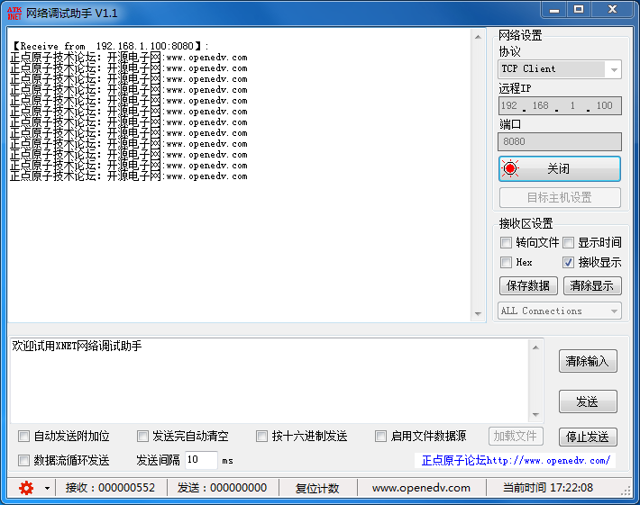

.. 正点原子产品资料汇总, created by 2020-03-19 正点原子-alientek 

网络调试助手软件(ATK-XNET) 版本：v1.7
============================================

资料链接
------------

- 百度网盘-链接：https://pan.baidu.com/s/1hc0_GLCY6AvDZFrQKEj9Gw
- 提取码：asqe
  

软件介绍
----------

- 支持UDP/TCP Server/TCP Client三种通信协议
- 支持数据来源显示、时间戳显示
- 支持接收数据转向文件存储
- 支持HEX显示/发送
- 支持窗口保存
- 支持目标主机设置（UDP模式）
- 支持连接列表显示，可指定连接对象通信
- 支持文件发送
- 支持数据流循环发送
- 支持发送/接收计数
- 支持发送区/接收区的字体大小、颜色、背景色设置
- 支持简体中文、繁体中文和英文三种语言
- 支持正点原子软件仓库

软件图片
--------

.. _pic_major_T100:

   
  网络调试助手软件界面图

官方店铺
-------- 

正点原子官方淘宝店：https://openedv.taobao.com 

产品问题答疑
------------

- 阿里旺旺：https://openedv.taobao.com 上淘宝直接一对一咨询技术。  
- 开源电子网【论坛】：http://www.openedv.com/forum.php 
- QQ群：http://www.openedv.com/forum.php   点击首页“官方QQ群”即可加入最新群。 
- 微信群：http://www.openedv.com/forum.php 点击首页“微信群”即可加入最新群。
  

关于正点原子  
-----------------

 | :ref:`公司简介` 
 | :ref:`联系方式`

